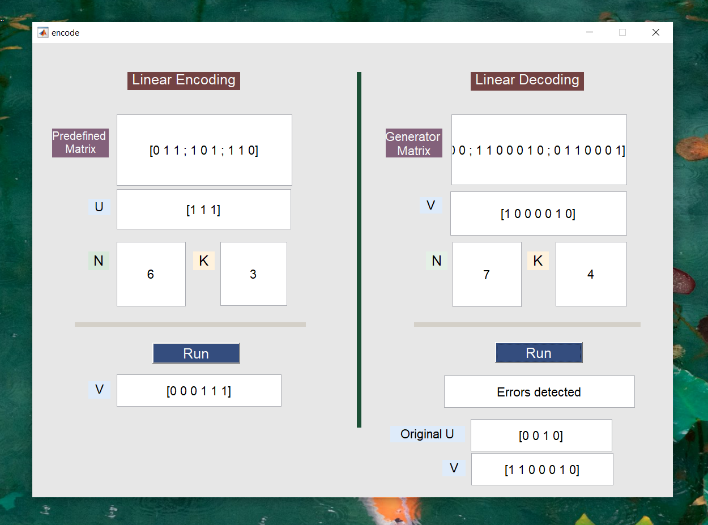

# Linear Bits 🖇

This simple project is a **Linear Block Coding system** implemented using MATLAB GUI.  
It performs **encoding, decoding, and error detection/correction** for binary messages based on vector and matrix operations.

---

## Application Idea

The system works on binary vectors and uses a **generator matrix (G)** and a **parity-check matrix (H)** to:

- Encode original messages vectors using generator matrix
- Decode received vectors
- Detect errors in received messages using syndrome calculation
- Correct single-bit errors (if possible)
- Recover the original message

---

## Concepts and Technologies

- Linear Block Codes
- Generator Matrix (G)
- Parity Check Matrix (H)
- Syndrome decoding
- Binary vector arithmetic (mod 2)
- MATLAB
- GUIDE GUI
- Linear Algebra

---

## How It Works

1. Input message vector **u**
2. Define parameters **n, k**
3. Enter predefined matrix **P**
4. Generate **G = [I | P]**
5. Encode message → **v = u × G**
6. (Optional) Introduce errors
7. Decode received vector using syndrome
8. Correct errors and recover original message

---

## GUI Overview

The Application contains a simple MATLAB GUI that allows:
- Input message vector
- Input generator/parity matrices
- Encoding & decoding buttons
- Error detection output
- Corrected message display

---

##  Note

This Application is part of the **Information Theory** course that demonstrates practical implementation of linear block codes.